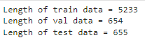

## Background
Twitter is a powerful tool that enables people to express their thoughts anywhere and anytime. One the of byproducts of such capability is the fast report of a disaster when there is witness around. However, to find real disaster tweets is not a trivial task. For example, people may use "disaster words", such as burning and explosive to describe sunset and atmosphere of a pop music concert. Therefore, the classifier is required to be able to process natural language, not only by extracting disaster key words, but also by comprehending the whole sentense. Considering those requirements, BERT model would be a good candidate for two good reasons:

1. BERT can generate contextualized word embedding.
2. BERT can generate a single vector representing the a whole sentence.

## Data preprocessing
Here we use the Kaggle dataset: https://www.kaggle.com/competitions/nlp-getting-started/data

The data comes with the columns 'keyword' and 'location'. However, a quick look into the data shows that there is not much relationship between 'keyword', 'location' and whether or not a disaster happens. Therefore, we will just consider the 'text' column.

We clean the text by the following steps:

1. lowercase all characters, remove '\' and replace '_' by ' '
2. remove emails, urls
3. remove special characters, accented characters

To ensure fairness while training, we choose to balance the positive and negative tweets.

Finally, the dataset is randomly separated into training, validation and test sets.

## Modeling setup and training
BERT model has two major versions, BERT base and Bert large. Here we choose BERT base with 768 hidden units.

The text is input into the BERT model to obtain proper embeddings. The encoded message is then fed into a dense neural network (with some dropouts), i.e., a classifier to predict if it is a disaster tweet. See the summary of the model below.

After training, the classifier has reached around 75% accuracy in the validation tests, and around 80% in the test sets.

